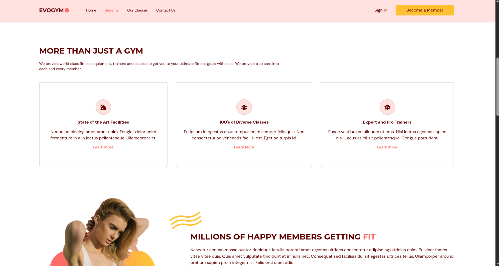
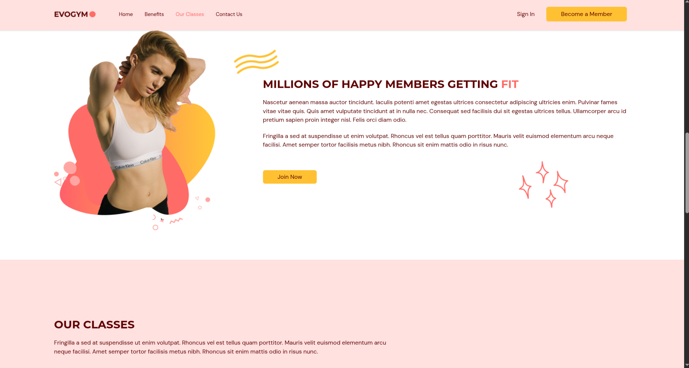
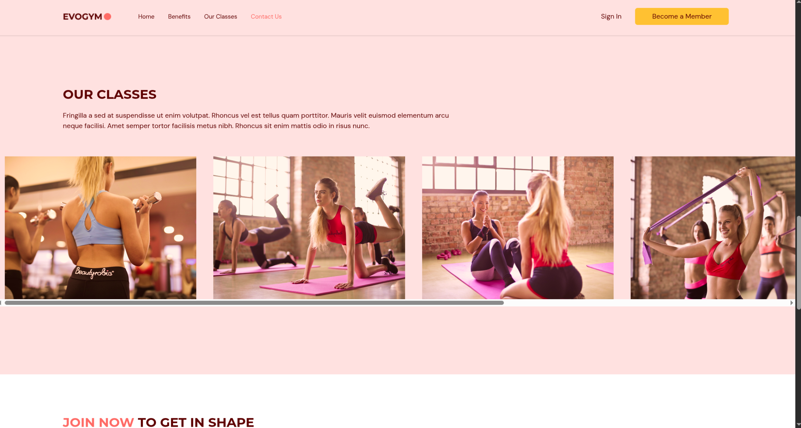
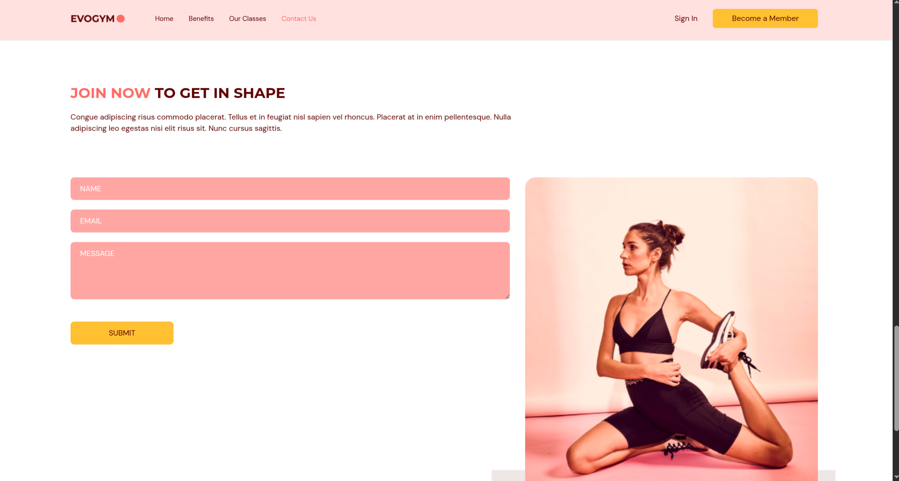

# 💪 Gym Website - TypeScript React Application

A modern, responsive gym website built with React, TypeScript, and Tailwind CSS. This application features smooth animations, form handling, and a beautiful user interface designed to showcase a fitness center's services and facilities.


---

## 📸 Project Overview

This section provides a visual walkthrough of the application's main sections and features.

### Hero Section


The **Hero Section** is the landing area of the website, featuring:
- **Animated text graphics** with the gym's branding ("EVOLVE")
- **Compelling call-to-action** buttons to encourage user engagement
- **Smooth scroll animations** powered by Framer Motion
- **Responsive design** that adapts beautifully to all screen sizes
- **Action buttons** that navigate users to the contact form or membership signup

This section sets the tone for the entire website, immediately capturing visitors' attention with dynamic animations and clear messaging about the gym's value proposition.

---

### Benefits Section



The **Benefits Section** highlights the gym's key advantages:
- **Three main benefits** displayed as interactive cards:
  - State of the Art Facilities
  - 100's of Diverse Classes
  - Expert and Pro Trainers
- **Icon-based visual representation** using Heroicons
- **Staggered animations** that reveal each benefit card sequentially
- **Descriptive text** explaining each benefit in detail
- **Graphic elements** and visual assets that enhance the section's appeal

Each benefit card uses Framer Motion animations to create an engaging user experience as users scroll through the page.

---

### Our Classes Section



The **Our Classes Section** showcases the variety of fitness classes available:
- **Grid layout** displaying multiple class types with images
- **Class categories** including:
  - Weight Training Classes
  - Training Classes
  - Fitness Classes
  - Adventures Classes
  - Ab Core Classes
  - Yoga Classes
- **Hover effects** and interactive elements on each class card
- **Responsive grid** that adjusts based on screen size
- **Visual preview** of each class type with high-quality images

This section helps potential members understand the diverse range of fitness options available at the gym.

---

### Additional Section



This section provides additional information about the gym, potentially featuring:
- **Testimonials** or member success stories
- **Additional services** or amenities
- **Special offers** or promotions
- **Gallery** of facilities or classes
- **Statistics** about the gym's achievements

The exact content may vary, but it serves to further engage visitors and provide more reasons to join the gym.

---

### Contact Form



The **Contact Form** is a fully functional contact section featuring:
- **Form validation** using React Hook Form
- **Three input fields**:
  - Name (required, max 100 characters)
  - Email (required, with email pattern validation)
  - Message (required, max 2000 characters)
- **Real-time validation feedback** with error messages
- **Email integration** using EmailJS for sending emails directly from the frontend
- **Loading states** with "ENVIANDO..." (Sending...) indicator
- **Success/error notifications** with animated feedback messages
- **Form reset** after successful submission
- **Responsive design** that works on all devices

The form includes proper error handling, user feedback, and integrates seamlessly with EmailJS to send contact form submissions directly to the gym's email address.

---

## 🚀 Technologies & Libraries

### Core Technologies

- **React 19.0.0** - Modern UI library for building user interfaces
- **TypeScript 5.7.2** - Type-safe JavaScript for better development experience
- **Vite 6.1.0** - Next-generation frontend build tool for fast development

### UI & Styling

- **Tailwind CSS 3.4.17** - Utility-first CSS framework for rapid UI development
- **Framer Motion 12.4.2** - Production-ready motion library for React animations
- **Heroicons 2.2.0** - Beautiful hand-crafted SVG icons

### Form Handling

- **React Hook Form 7.54.2** - Performant forms with easy validation
- **EmailJS Browser 4.4.1** - Email service integration for contact forms

### Navigation & UX

- **React Anchor Link Smooth Scroll 1.0.12** - Smooth scrolling navigation between sections

### Development Tools

- **ESLint 9.19.0** - Code linting and quality assurance
- **Prettier 3.5.0** - Code formatting
- **TypeScript ESLint 8.22.0** - TypeScript-specific linting rules
- **PostCSS 8.5.2** - CSS processing tool
- **Autoprefixer 10.4.20** - Automatic vendor prefixing

---

## 📁 Project Structure

```
gym-typescript/
├── public/                 # Static assets
│   └── vite.svg
├── src/
│   ├── assets/            # Images and graphics
│   │   ├── *.png          # Various images for sections
│   │   └── Logo.png       # Gym logo
│   ├── hooks/             # Custom React hooks
│   │   └── useMediaQuery.ts
│   ├── scenes/            # Main page sections/components
│   │   ├── navbar/        # Navigation bar
│   │   ├── home/          # Hero section
│   │   ├── benefits/      # Benefits section
│   │   ├── ourclasses/    # Classes showcase
│   │   ├── contactus/     # Contact form section
│   │   └── footer/        # Footer component
│   ├── services/          # External service integrations
│   │   └── emailService.ts # EmailJS service
│   ├── shared/            # Shared components and utilities
│   │   ├── ActionButton.tsx
│   │   ├── HText.tsx
│   │   └── types.ts       # TypeScript types and enums
│   ├── App.tsx            # Main application component
│   ├── main.tsx           # Application entry point
│   └── index.css          # Global styles
├── docs/
│   └── images/            # Documentation screenshots
├── .env                   # Environment variables (not committed)
├── eslint.config.js       # ESLint configuration
├── package.json           # Dependencies and scripts
├── tailwind.config.cjs    # Tailwind CSS configuration
├── tsconfig.json          # TypeScript configuration
└── vite.config.ts         # Vite build configuration
```

---

## 🔄 Application Flow

### 1. **Initialization**
- Application loads and initializes React components
- State management for selected page and scroll position
- Navbar detects if user is at top of page

### 2. **Navigation Flow**
```
User lands on page
    ↓
Hero Section (Home) - First impression
    ↓
Benefits Section - Key advantages
    ↓
Our Classes Section - Available classes
    ↓
Contact Us Section - Form submission
    ↓
Footer - Additional information
```

### 3. **Scroll-Based Navigation**
- **Scroll detection**: App tracks scroll position to update navbar state
- **Smooth scrolling**: Clicking navbar links smoothly scrolls to sections
- **Active section tracking**: Current section is highlighted in navbar
- **Viewport detection**: Framer Motion triggers animations when sections enter viewport

### 4. **Form Submission Flow**
```
User fills form
    ↓
React Hook Form validates inputs
    ↓
If valid:
    ↓
    Show loading state ("ENVIANDO...")
    ↓
    EmailJS sends email
    ↓
    Show success message
    ↓
    Reset form
    ↓
If invalid:
    ↓
    Show validation errors
```

### 5. **Responsive Behavior**
- **Mobile**: Hamburger menu, stacked layouts, optimized images
- **Tablet**: Adjusted grid layouts, responsive navigation
- **Desktop**: Full navigation bar, side-by-side layouts, enhanced animations

---

## 🛠️ Installation & Setup

### Prerequisites

- Node.js (v18 or higher recommended)
- npm or yarn package manager

### Installation Steps

1. **Clone the repository**
   ```bash
   git clone <repository-url>
   cd gym-typescript
   ```

2. **Install dependencies**
   ```bash
   npm install
   ```

3. **Configure EmailJS** (for contact form)
   
   Create a `.env` file in the root directory:
   ```env
   VITE_EMAILJS_PUBLIC_KEY=your_public_key_here
   VITE_EMAILJS_SERVICE_ID=your_service_id_here
   VITE_EMAILJS_TEMPLATE_ID=your_template_id_here
   ```
   
   See [EmailJS Configuration](#-emailjs-configuration) section for detailed setup instructions.

4. **Start development server**
   ```bash
   npm run dev
   ```

5. **Build for production**
   ```bash
   npm run build
   ```

6. **Preview production build**
   ```bash
   npm run preview
   ```

---

## 📧 EmailJS Configuration

The contact form uses EmailJS to send emails directly from the frontend. Follow these steps to configure:

### 1. Create EmailJS Account
- Visit [https://www.emailjs.com/](https://www.emailjs.com/)
- Sign up for a free account (200 emails/month)

### 2. Configure Email Service
- Go to **Email Services** in the dashboard
- Add a service (Gmail, Outlook, etc.)
- Follow instructions to connect your email account
- Note your **Service ID**

### 3. Create Email Template
- Navigate to **Email Templates**
- Create a new template named "Contact Us"
- Use these variables in your template:
  - `{{name}}` or `{{from_name}}` - Sender's name
  - `{{email}}` - Sender's email
  - `{{message}}` - Message content
- Copy the **Template ID**

### 4. Get Public Key
- Go to **Account** → **General**
- Copy your **Public Key**

### 5. Environment Variables
Create a `.env` file in the project root:

```env
VITE_EMAILJS_PUBLIC_KEY=your_public_key_here
VITE_EMAILJS_SERVICE_ID=your_service_id_here
VITE_EMAILJS_TEMPLATE_ID=your_template_id_here
```

**Important**: 
- The `.env` file should not be committed to Git (already in `.gitignore`)
- Restart the development server after creating/updating `.env`

### Alternative: Manual Configuration
If you prefer not to use environment variables, edit `src/services/emailService.ts` and replace the placeholder values directly.

---

## ✨ Key Features

### 🎨 **Animations & Interactions**
- Smooth scroll animations using Framer Motion
- Staggered animations for list items
- Viewport-based animation triggers
- Hover effects on interactive elements
- Loading states and transitions

### 📱 **Responsive Design**
- Mobile-first approach
- Breakpoints at 480px, 768px, and 1060px
- Adaptive navigation (hamburger menu on mobile)
- Responsive grid layouts
- Optimized images for different screen sizes

### ✅ **Form Validation**
- Real-time validation with React Hook Form
- Custom validation rules (email pattern, max length)
- User-friendly error messages
- Visual feedback for form states

### 🎯 **User Experience**
- Smooth scrolling between sections
- Active section highlighting in navbar
- Scroll-based navbar styling changes
- Clear call-to-action buttons
- Intuitive navigation flow

### 🔒 **Type Safety**
- Full TypeScript implementation
- Type-safe props and state management
- Enum-based page selection
- Interface definitions for data structures

---

## 🎯 Available Scripts

- `npm run dev` - Start development server with hot reload
- `npm run build` - Build production-ready application
- `npm run preview` - Preview production build locally
- `npm run lint` - Run ESLint to check code quality

---

## 🏗️ Architecture Decisions

### Component Organization
- **Scene-based structure**: Each major section is a "scene" component
- **Shared components**: Reusable components in `shared/` directory
- **Service layer**: External integrations separated into `services/`

### State Management
- **Local state**: React hooks (`useState`, `useEffect`) for component state
- **Props drilling**: Selected page state passed down through components
- **Scroll detection**: Window scroll events for navbar state

### Styling Approach
- **Tailwind CSS**: Utility-first CSS for rapid development
- **Custom theme**: Extended Tailwind config with brand colors
- **Responsive utilities**: Mobile-first responsive design

### Animation Strategy
- **Framer Motion**: Consistent animation library throughout
- **Viewport triggers**: Animations trigger when elements enter viewport
- **Performance**: Optimized animations with `once: true` to prevent re-triggering

---

## 🔧 Customization

### Colors
Edit `tailwind.config.cjs` to customize the color scheme:
```javascript
colors: {
  "primary-100": "#FFE1E0",
  "primary-300": "#FFA6A3",
  "primary-500": "#FF6B66",
  "secondary-400": "#FFCD5B",
  "secondary-500": "#FFC132",
}
```

### Content
- Update text content in respective scene components
- Replace images in `src/assets/` directory
- Modify class data in `src/scenes/ourclasses/index.tsx`
- Update benefits in `src/scenes/benefits/index.tsx`

### Animations
Adjust animation timing and effects in component files using Framer Motion variants.

---

## 📝 License

This project is private and for educational purposes.

---

## 👨‍💻 Development

Built with modern web technologies and best practices:
- Component-based architecture
- Type-safe development with TypeScript
- Responsive design principles
- Performance optimization
- Clean code structure

---

## 🤝 Contributing

This is a private project. For questions or suggestions, please contact the repository owner.

---

**Made with ❤️ using React, TypeScript, and Tailwind CSS**
